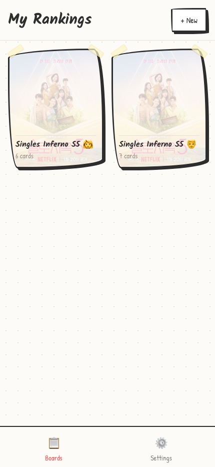
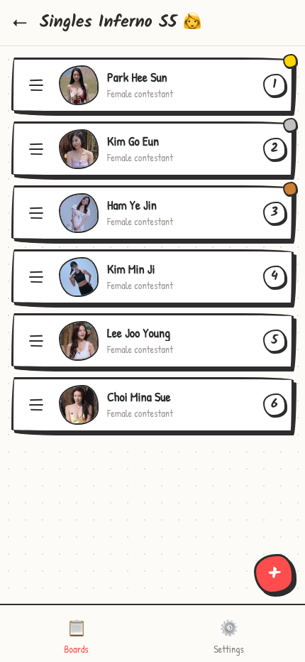
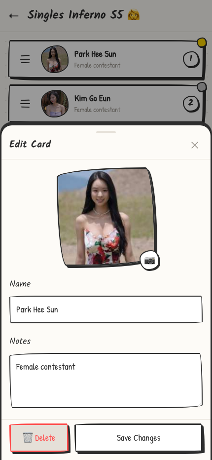

# Hot Takes

A mobile-first PWA for ranking things with drag-and-drop. Features a distinctive hand-drawn aesthetic inspired by paper and pencil sketches.

## Screenshots

<p align="center">
  
  
  
</p>

## Features

### Board Management
- **Create boards** - Organize rankings into separate boards (e.g., "Favorite Movies", "Best Restaurants")
- **2-column grid view** - Browse all your boards at a glance with card counts
- **Cover images** - Boards display their cover image for visual identification

### Drag-and-Drop Ranking
- **Long-press to drag** - Hold a card to pick it up and reorder
- **Smooth animations** - Spring physics and wobble effects while dragging
- **Live rank updates** - Rank badges update in real-time as you drag
- **Dedicated drag handle** - Drag from the handle icon to avoid accidental reordering

### Card/Contestant Management
- **Add cards** - Create new items with name, photo, and notes
- **Edit details** - Tap any card to open the detail modal
- **Photo support** - Add photos from camera or photo library
- **Notes field** - Add personal notes or comments to each card
- **Delete with confirmation** - Remove cards with a safety confirmation

### Photo Management
- **Camera integration** - Take photos directly from the app
- **Photo library** - Choose existing photos from your device
- **Automatic compression** - Images are compressed to save storage
- **Thumbnail generation** - Optimized thumbnails for fast list rendering

### Seed Data
- **Singles Inferno Season 5** - Pre-loaded sample data with the show's cast
- **Separate boards** - Men and women contestants split into separate boards
- **Photos included** - All contestant photos fetched automatically
- **Progress indicator** - See loading progress while photos download

### Data Management
- **Export to JSON** - Backup all your boards and cards to a file
- **Import from JSON** - Restore or transfer data from a backup
- **Merge on import** - Imported data merges with existing data (duplicates skipped)
- **Clear all data** - Reset the app with confirmation dialog

## Design System

The app uses a hand-drawn aesthetic throughout:

- **Wobbly borders** - Irregular border-radius that mimics hand-drawn shapes
- **Hard shadows** - No blur, offset shadows like pencil strokes
- **Paper texture** - Warm off-white background with subtle dot pattern
- **Handwriting fonts** - Kalam (headings) and Patrick Hand (body text)
- **Soft colors** - Pencil black (#2d2d2d), correction marker red (#ff4d4d)

## Tech Stack

| Layer | Technology |
|-------|------------|
| Framework | Vite + React 19 + TypeScript |
| Styling | Tailwind CSS v4 |
| Animation | Framer Motion |
| Storage | IndexedDB (images) + localStorage (data) |
| Testing | Vitest + React Testing Library + Playwright |
| Deployment | GitHub Pages |

## Getting Started

### Prerequisites
- Node.js 18+
- npm 9+

### Installation

```bash
# Clone the repository
git clone https://github.com/mcotse/hot-takes.git
cd hot-takes

# Install dependencies
npm install

# Start development server
npm run dev
```

Then open http://localhost:5173/hot-takes/

### Build for Production

```bash
npm run build
npm run preview
```

## Load Sample Data

Want to try the app with pre-loaded content?

1. Go to **Settings** tab
2. Click **Load Cast & Photos** under Sample Data
3. Wait for photos to download (progress shown)
4. Two boards created: "Singles Inferno S5 - Women" and "Singles Inferno S5 - Men"

## Available Scripts

| Script | Description |
|--------|-------------|
| `npm run dev` | Start development server |
| `npm run build` | Build for production |
| `npm run preview` | Preview production build |
| `npm run test` | Run tests in watch mode |
| `npm run test:run` | Run tests once |
| `npm run lint` | Run ESLint |
| `npm run version:patch` | Bump patch version (0.0.X) |
| `npm run version:minor` | Bump minor version (0.X.0) |
| `npm run version:major` | Bump major version (X.0.0) |

## Project Structure

```
src/
├── components/          # React components
│   ├── ui/             # Reusable UI primitives (Button, Card, etc.)
│   ├── RankCard.tsx    # Individual ranking card
│   ├── RankList.tsx    # Draggable list of cards
│   ├── BoardCard.tsx   # Board preview card
│   ├── BoardGrid.tsx   # 2-column board grid
│   └── ...
├── pages/              # Page-level components
│   ├── BoardsPage.tsx  # Main board list view
│   ├── BoardDetailPage.tsx  # Single board view
│   └── SettingsPage.tsx     # Settings & data management
├── hooks/              # Custom React hooks
│   ├── useBoards.ts    # Board CRUD operations
│   ├── useCards.ts     # Card CRUD operations
│   └── useImageStorage.ts  # IndexedDB image handling
├── lib/                # Utilities and helpers
│   ├── db.ts          # IndexedDB wrapper
│   ├── storage.ts     # localStorage wrapper
│   ├── imageUtils.ts  # Image compression utilities
│   └── types.ts       # TypeScript interfaces
├── styles/            # Design tokens and utilities
│   ├── wobbly.ts     # Wobbly border-radius presets
│   └── tokens.ts     # Animation configs, colors
└── data/             # Seed data
    └── singlesInfernoS5.ts  # Cast data and photos
```

## Device Support

Optimized for **iPhone 14 Pro Max** (430 x 932 logical pixels) but works on any modern mobile browser.

- iOS Safari
- Chrome for Android
- Desktop browsers (responsive)

## Contributing

1. Fork the repository
2. Create a feature branch (`git checkout -b feature/amazing-feature`)
3. Follow the project's code style (TypeScript strict mode, Tailwind CSS)
4. Write tests for new features
5. Commit your changes (`git commit -m 'feat: add amazing feature'`)
6. Push to the branch (`git push origin feature/amazing-feature`)
7. Open a Pull Request

## License

MIT
